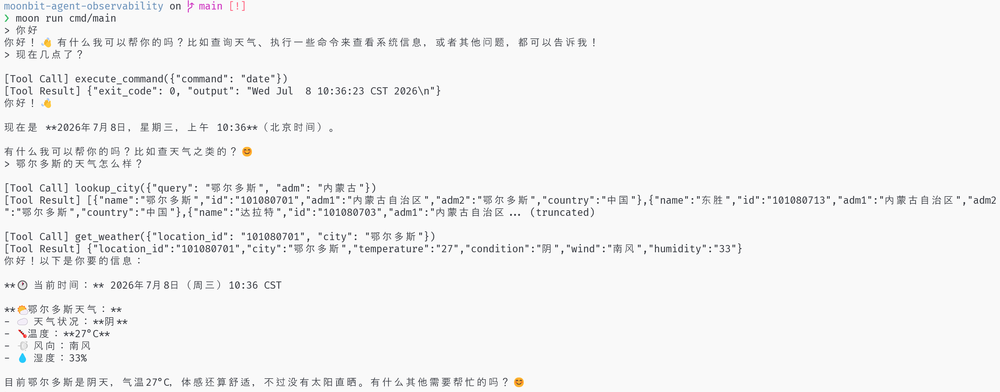
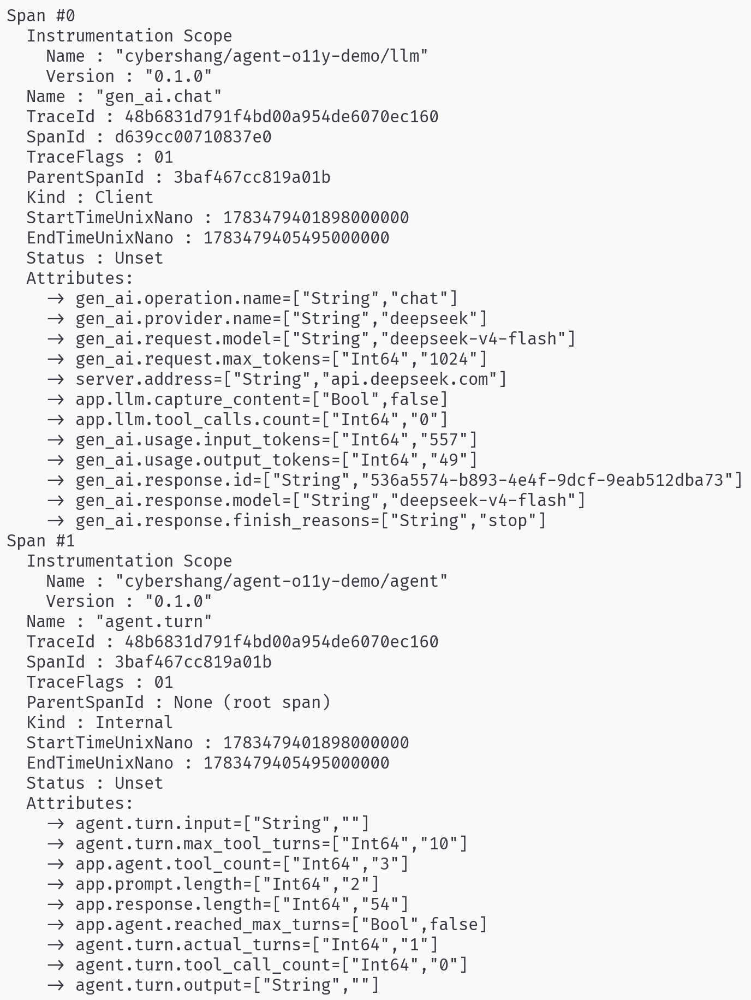
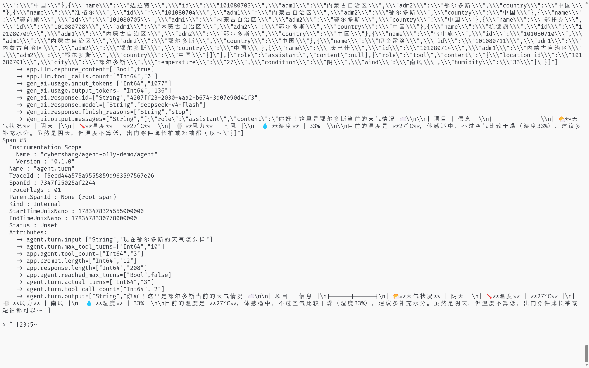
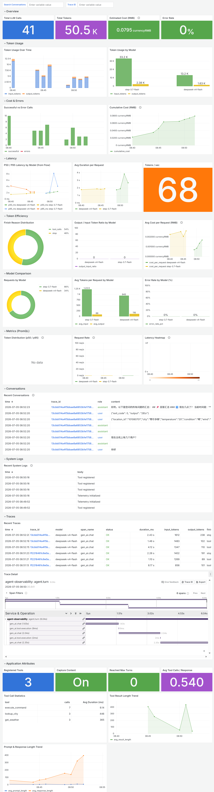
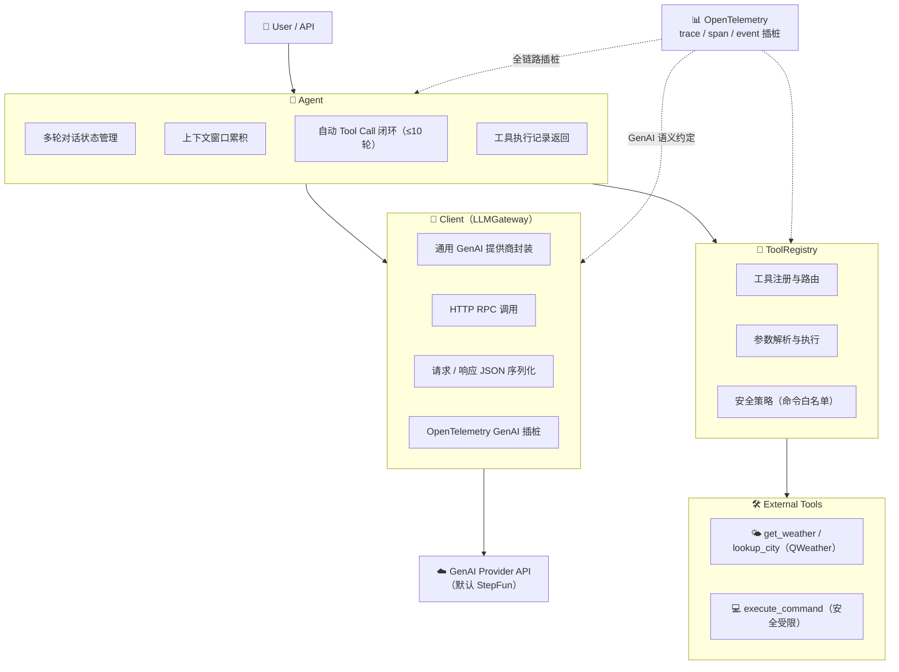

# Agent Observability Demo

[](https://github.com/cybershang/moonbit-agent-observability/actions/workflows/ci.yml)

参加 MoonBit 2026开源大赛，目标是智能体可观测。
本人项目内容包含：
- [智能体插桩库](https://github.com/cybershang/agent-telemetry)
- [已插桩的智能体项目示例](https://github.com/cybershang/moonbit-agent-observability)

智能体插桩库已发布到 MoonBit 官方包仓库 [mooncakes.io](https://mooncakes.io/docs/cybershang/agent-telemetry)，在本仓库中作为submodule。


## 演示Demo
### 实现了基础的交互和LLM插桩
视频：https://www.bilibili.com/video/BV1n4EZ61EmU

Agent基础交互，包含多轮对话和工具调用:


使用OTEL_STDOUT开启遥测信号回显：


使用CAPTURE_CONTENT开启对用户输入和LLM响应的采集：



## Grafana 仪表盘

使用 GreptimeDB + Grafana 部署的完整可观测性面板，覆盖 Traces、Metrics、Logs 三大支柱：



部署方式见 [`deploy/greptime/README.md`](deploy/greptime/README.md)。

## Agent架构



## 核心模块

| 模块 | 文件 | 职责 |
|---|---|---|
| **Agent** | `agent.mbt` | 对话编排：维护消息历史、自动 tool call 循环、返回结构化结果 |
| **Client** | `llm.mbt` | 通用 GenAI 客户端：封装 HTTP 调用、管理消息类型、OTel GenAI 插桩 |
| **ToolRegistry** | `tools.mbt` | 工具定义表，供 Agent 注册到 LLM |
| **Settings** | `settings.mbt` | 集中管理所有运行时配置：`Settings` struct + `from_env()` |
| **Telemetry Lib** | `agent-telemetry/` | 可复用插桩库：provider 初始化、tracer、GenAI/Tool/Agent 语义 helper |
| **REPL 入口** | `cmd/main/main.mbt` | 配置加载、初始化 OTel、启动交互循环 |

## 快速开始

### 依赖

- [MoonBit](https://www.moonbitlang.com/) 工具链
- Linux 系统需安装 `build-essential`（提供 C 头文件用于 native 编译）

### 配置

复制示例配置并编辑：

```bash
cp .env.example .env
# 编辑 .env，填入你的 API Key
```

支持的配置项（环境变量或 `.env` 文件均可）：

| 变量 | 说明 | 默认值 |
|---|---|---|
| `LLM_API_KEY` | GenAI 提供商 API Key | 必填 |
| `LLM_PROVIDER` | 提供商标识（用于 OTel） | `stepfun` |
| `LLM_BASE_URL` | 聊天补全 API 基础 URL | `https://api.stepfun.com/v1` |
| `LLM_MODEL` | 模型名称 | `step-3.7-flash` |
| `LLM_MAX_TOKENS` | 每次请求最大 token 数 | `1024` |
| `AGENT_MAX_TOOL_TURNS` | Agent 自动 tool call 最大轮数 | `10` |
| `OTEL_STDOUT` | 是否输出 OTel trace 到 stdout | `false` |
| `CAPTURE_CONTENT` | 是否在 span 中采集用户/助手消息内容 | `false` |
| `QWEATHER_TOKEN` | 和风天气 JWT Token（新 Platform API） | 必填 |
| `QWEATHER_API_KEY` | 和风天气旧版 Web API Key（作为 `QWEATHER_TOKEN` 的 fallback） | - |
| `QWEATHER_API_HOST` | 和风天气 API 主机，标准订阅用 `https://api.qweather.com`，开发版用 `https://devapi.qweather.com` | `https://devapi.qweather.com` |

所有配置在运行时被加载到 `Settings` 结构体中，随后传递给 `Client` 与 `Agent`，避免在业务代码中散落环境变量读取逻辑。`QWEATHER_*` 配置由 `tools.mbt` 在工具执行时读取。

### 运行

```bash
# 检查类型
moon check

# 运行 REPL
moon run cmd/main

# 非交互式单次运行（适合 CI / 演示 / 脚本）
moon run cmd/main -- --ask "北京今天天气怎么样？"
```

### 测试

```bash
# 运行所有 async test
moon test
```

## 本地可观测性栈

项目提供了最小化的本地 Collector + Jaeger 组合：

```bash
cd deploy/minimum
docker compose up -d
```

启动后：
- OTLP HTTP receiver: `http://localhost:4318`
- OTLP gRPC receiver: `http://localhost:4317`
- Jaeger UI: `http://localhost:16686`

运行 REPL 并导出 trace 到 Collector（保持 `.env` 中 `OTEL_STDOUT=false` 或直接覆盖环境变量）：

```bash
OTEL_STDOUT=false moon run cmd/main
```

发送一条消息后，打开 http://localhost:16686 即可在 Jaeger 中查看 trace。Service 名称为 `agent-observability`（可通过 `OTEL_SERVICE_NAME` 环境变量覆盖）。

Batch Span Processor 针对交互式 REPL 做了调优，你也可以通过标准环境变量覆盖：

| 变量 | 默认值 |
|---|---|
| `OTEL_BSP_MAX_QUEUE_SIZE` | `64` |
| `OTEL_BSP_MAX_EXPORT_BATCH_SIZE` | `16` |
| `OTEL_BSP_SCHEDULE_DELAY` | `1000` |
| `OTEL_BSP_EXPORT_TIMEOUT` | `5000` |

## `agent-telemetry` 库

仓库中的 `agent-telemetry/` 是一个独立的 MoonBit 包，封装了 Agent/LLM/Tool 场景的 OpenTelemetry 插桩。原 `agent-observability` 应用已改用此库实现。

安装方式：`moon add cybershang/agent-telemetry`

详细 API 文档与使用示例请参见 [`agent-telemetry/README.md`](agent-telemetry/README.md)。

## 项目结构

```
agent-observability/
├── agent-telemetry/         # 独立 MoonBit 插桩库（已发布到 mooncakes.io）
│                            # 封装 OTel 初始化、tracer、GenAI/Tool/Agent 语义 helper
├── cmd/main/                # REPL 可执行入口
├── deploy/                  # 一键部署配置
│   ├── minimum/             #   本地 Collector + Jaeger（docker-compose）
│   └── greptime/            #   生产级 GreptimeDB + Grafana 栈
├── docs/                    # 文档
│   ├── instrumentation.md   #   插桩位置与 Span 命名详解
│   └── findings.md          #   开发过程中的技术发现记录
├── scripts/                 # 辅助脚本
├── proposal.md              # 比赛申报书
├── report.md                # 结项报告
├── AGENTS.md                # 开发指南与约定
├── .env.example             # 环境变量配置模板
└── moon.work                # 工作区定义（根包 + agent-telemetry）
```

## 技术栈

| 层级 | 技术 |
|---|---|
| 语言 | MoonBit |
| 运行时 | `moonbitlang/async` — 原生异步运行时 |
| 构建目标 | Native |
| 默认 LLM 提供商 | StepFun API |
| 可观测性 | OpenTelemetry（已实现） |

## 已知问题

### `moon check` 中的 `unused_package` 警告

运行 `moon check` 时可能会出现若干 `unused_package` 警告，**不影响功能**，原因如下：

1. **`moonbitlang/async` 报 unused**：`async fn` / `async test` 语法需要此包，但编译器只检测 `@async.xxx` 显式调用，不把关键字本身算作"使用"。
2. **测试依赖报 unused**（`@sdk` 等）：这些包在测试文件中使用，但 MoonBit 的 `moon.pkg` 是包级配置，编译器不把测试文件中的使用算作"库的使用"。
3. `agent-telemetry` 包与根应用通过 `moon.work` 组成工作区；根应用导入本地 `cybershang/agent-telemetry` 包。
4. **`agent-telemetry` 默认后端为 native**：`opentelemetry/otlp` 依赖的 `async/http`、`async/socket` 接口只在 native 后端可用，因此库模块声明了 `preferred_target = "native"`。

MoonBit 目前不支持文件级导入或独立的测试子包，因此这些警告在当前结构下无法消除。CI 已移除 `--deny-warn` 以避免因此失败。

## 许可证

本项目采用 [木兰宽松许可证，第 2 版](http://license.coscl.org.cn/MulanPSL2)（Mulan PSL v2）开源许可。
Copyright (c) 2026 Yingjie Shang
