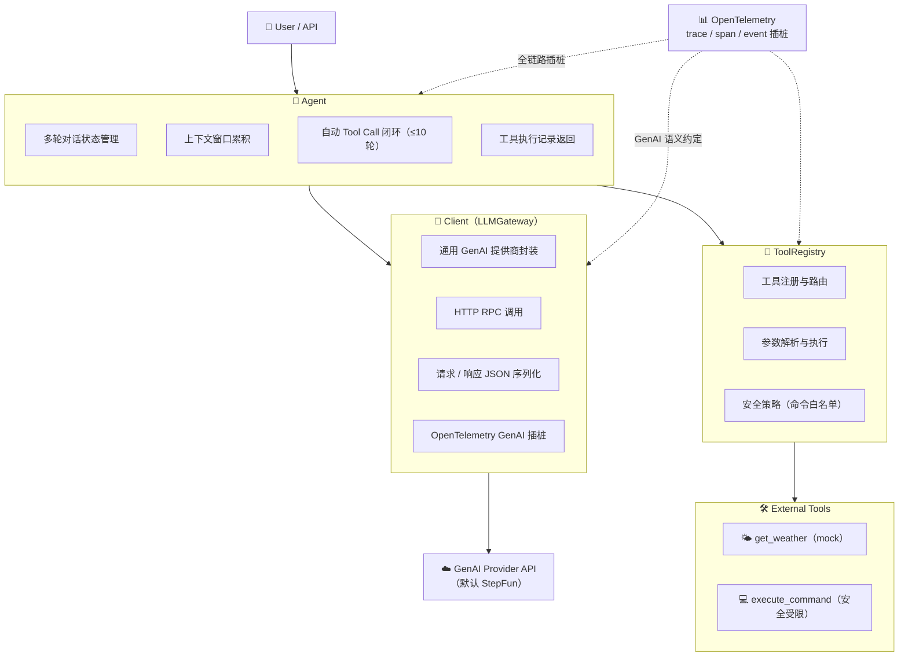

# agent-observability

[](https://github.com/cybershang/moonbit-agent-observability/actions/workflows/ci.yml)

基于 MoonBit 实现的精简 AI Agent，演示 Agent 核心运行链路的 OpenTelemetry 可观测性插桩。

## 演示Demo
### 实现了基础的交互和LLM插桩
视频：https://www.bilibili.com/video/BV1n4EZ61EmU

Agent基础交互，包含多轮对话和工具调用:


使用OTEL_STDOUT开启遥测信号回显：


使用CAPTURE_CONTENT开启对用户输入和LLM响应的采集：


## Agent架构


```

## 核心模块

| 模块 | 文件 | 职责 |
|---|---|---|
| **Agent** | `agent.mbt` | 对话编排：维护消息历史、自动 tool call 循环、返回结构化结果 |
| **Client** | `llm.mbt` | 通用 GenAI 客户端：封装 HTTP 调用、管理消息类型、OTel GenAI 插桩 |
| **ToolRegistry** | `tools.mbt` | 工具定义表，供 Agent 注册到 LLM |
| **Settings** | `settings.mbt` | 集中管理所有运行时配置：`Settings` struct + `from_env()` |
| **REPL 入口** | `cmd/main/main.mbt` | 配置加载、初始化 OTel、启动交互循环 |

## 快速开始

### 依赖

- [MoonBit](https://www.moonbitlang.com/) 工具链
- Linux 系统需安装 `build-essential`（提供 C 头文件用于 native 编译）

### 配置

复制示例配置并编辑：

```bash
cp .env.example .env
# 编辑 .env，填入你的 API Key
```

支持的配置项（环境变量或 `.env` 文件均可）：

| 变量 | 说明 | 默认值 |
|---|---|---|
| `LLM_API_KEY` | GenAI 提供商 API Key | 必填 |
| `LLM_PROVIDER` | 提供商标识（用于 OTel） | `stepfun` |
| `LLM_BASE_URL` | 聊天补全 API 基础 URL | `https://api.stepfun.com/v1` |
| `LLM_MODEL` | 模型名称 | `step-3.7-flash` |
| `LLM_MAX_TOKENS` | 每次请求最大 token 数 | `1024` |
| `AGENT_MAX_TOOL_TURNS` | Agent 自动 tool call 最大轮数 | `10` |
| `OTEL_STDOUT` | 是否输出 OTel trace 到 stdout | `false` |
| `CAPTURE_CONTENT` | 是否在 span 中采集用户/助手消息内容 | `false` |

所有配置在运行时被加载到 `Settings` 结构体中，随后传递给 `Client` 与 `Agent`，避免在业务代码中散落环境变量读取逻辑。

### 运行

```bash
# 检查类型
moon check

# 运行 REPL
moon run cmd/main
```

### 测试

```bash
# 运行所有 async test
moon test
```

## Agent Observability

当前项目已实现 **Agent 全链路**的 OpenTelemetry 插桩，Trace 结构如下：

```
agent.turn                    # Agent 编排层：一次完整的用户交互
├── gen_ai.chat             # 第 1 轮 LLM 调用（返回 tool_calls）
├── gen_ai.tool.execution   # 工具执行（如 get_weather）
└── gen_ai.chat             # 第 2 轮 LLM 调用（返回最终回复）
```

### Span 详情

**`agent.turn`**（Agent 编排层）
- `agent.turn.input` = 用户输入
- `agent.turn.max_tool_turns` = 最大允许轮数
- `agent.turn.actual_turns` = 实际执行轮数
- `agent.turn.tool_call_count` = 本 turn 执行的工具调用次数
- `agent.turn.output` = 最终回复
- 达到轮数上限时 `Status=Error`

**`gen_ai.chat`**（LLM Proxy 层）
- `gen_ai.operation.name` = `chat`
- `gen_ai.provider.name` = 配置的提供商名称
- `gen_ai.request.model` / `gen_ai.request.max_tokens`
- `gen_ai.usage.input_tokens` / `gen_ai.usage.output_tokens`
- `gen_ai.response.id` / `gen_ai.response.model` / `gen_ai.response.finish_reasons`
- `gen_ai.input.messages` / `gen_ai.output.messages`（当 `CAPTURE_CONTENT=true`）

**`gen_ai.tool.execution`**（工具执行层）
- `gen_ai.tool.name` = 工具名称
- `gen_ai.tool.call.arguments` = 调用参数
- `gen_ai.tool.call.result` = 执行结果
- 未知工具或执行出错时 `Status=Error`

通过设置 `OTEL_STDOUT=true` 可在 stdout 查看 trace 输出；设置 `CAPTURE_CONTENT=true` 可开启消息内容采集（默认关闭，避免敏感信息泄露）。

默认情况下，应用通过 **OTLP/HTTP** 将 trace 导出到 `http://localhost:4318`，可直接对接本地 OpenTelemetry Collector。

### 本地可观测性栈

项目提供了最小化的本地 Collector + Jaeger 组合：

```bash
cd deploy/minimum
docker compose up -d
```

启动后：
- OTLP HTTP receiver: `http://localhost:4318`
- OTLP gRPC receiver: `http://localhost:4317`
- Jaeger UI: `http://localhost:16686`

运行 REPL 并导出 trace 到 Collector（保持 `.env` 中 `OTEL_STDOUT=false` 或直接覆盖环境变量）：

```bash
OTEL_STDOUT=false moon run cmd/main
```

发送一条消息后，打开 http://localhost:16686 即可在 Jaeger 中查看 `gen_ai.chat` span 及完整属性。Service 名称为 `agent-observability`（可通过 `OTEL_SERVICE_NAME` 环境变量覆盖）。

Batch Span Processor 针对交互式 REPL 做了调优：
- `max_queue_size=64`
- `max_export_batch_size=16`
- `scheduled_delay_millis=1000`
- `export_timeout_millis=5000`

这样 span 会在 1 秒内或累积 16 条时被批量发送，退出前还会显式 `force_flush()` + `shutdown()`，避免数据丢失。你也可以通过标准环境变量覆盖：
- `OTEL_BSP_MAX_QUEUE_SIZE`
- `OTEL_BSP_MAX_EXPORT_BATCH_SIZE`
- `OTEL_BSP_SCHEDULE_DELAY`
- `OTEL_BSP_EXPORT_TIMEOUT`

Agent 编排层（`Agent::run`）与工具执行层的 trace 插桩已完整实现：
- ✅ **Agent turn 级别 span**（`agent.turn`）：记录输入/输出、实际工具调用轮数、最大允许轮数
- ✅ **Tool 执行 span**（`gen_ai.tool.execution`）：记录工具名称、调用参数、执行结果、错误状态

## 项目结构

```
agent-observability/
├── moon.mod                    # MoonBit 模块清单
├── moon.pkg                    # 根包导入声明
├── llm.mbt                     # Client：类型定义 + HTTP 封装 + OTel 插桩
├── llm_test.mbt                # Client 白盒测试
├── agent.mbt                   # Agent：对话编排 + tool 执行
├── tools.mbt                   # ToolRegistry：工具定义
├── settings.mbt                # Settings：集中配置管理 + .env 读取辅助
├── .env.example                # 配置模板
├── deploy/
│   └── minimum/                # 本地最小化 OTel Collector + Jaeger
│       ├── docker-compose.yml
│       └── otel-collector-config.yml
├── cmd/
│   └── main/
│       ├── moon.pkg            # 可执行包配置
│       └── main.mbt            # REPL 入口
└── AGENTS.md                   # 开发指南与约定
```

## 技术栈

| 层级 | 技术 |
|---|---|
| 语言 | MoonBit |
| 运行时 | `moonbitlang/async` — 原生异步运行时 |
| 构建目标 | Native |
| 默认 LLM 提供商 | StepFun API |
| 可观测性 | OpenTelemetry（已实现） |

## 已知问题

### `moon check` 中的 `unused_package` 警告

运行 `moon check` 时可能会出现若干 `unused_package` 警告，**不影响功能**，原因如下：

1. **`moonbitlang/async` 报 unused**：`async fn` / `async test` 语法需要此包，但编译器只检测 `@async.xxx` 显式调用，不把关键字本身算作"使用"。
2. **测试依赖报 unused**（`@stdio`、`@debug`、`@sdk`、`@print`）：这些包在 `llm_test.mbt` 中使用，但 MoonBit 的 `moon.pkg` 是包级配置，编译器不把测试文件中的使用算作"库的使用"。

MoonBit 目前不支持文件级导入或独立的测试子包，因此这些警告在当前结构下无法消除。CI 已移除 `--deny-warn` 以避免因此失败。

## 许可证

本项目采用 [木兰宽松许可证，第 2 版](http://license.coscl.org.cn/MulanPSL2)（Mulan PSL v2）开源许可。
Copyright (c) 2026 Yingjie Shang
